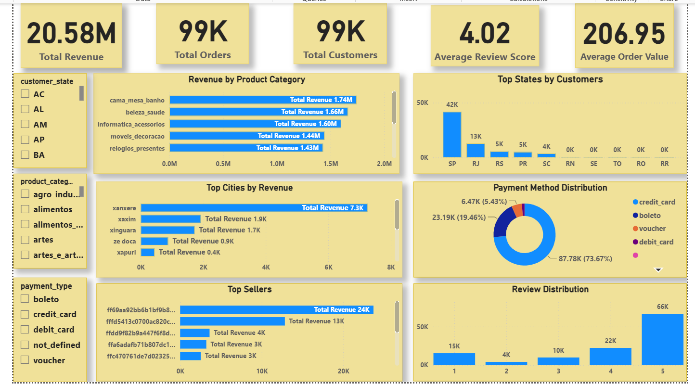
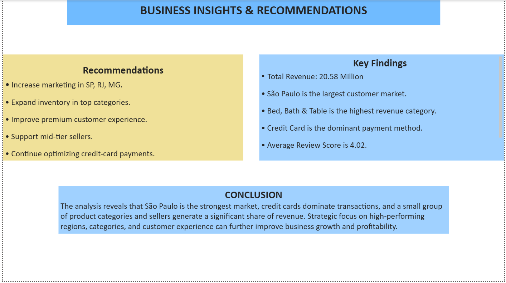
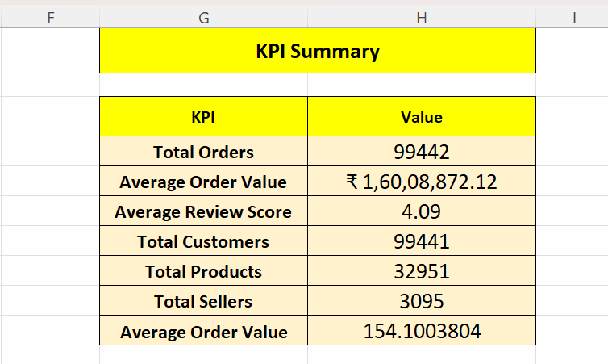
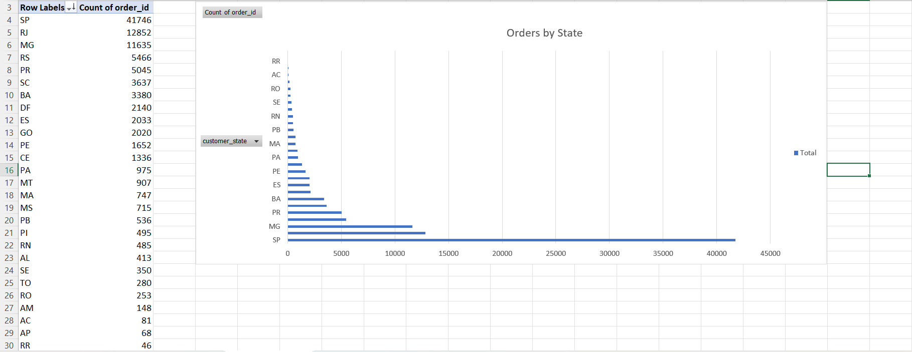
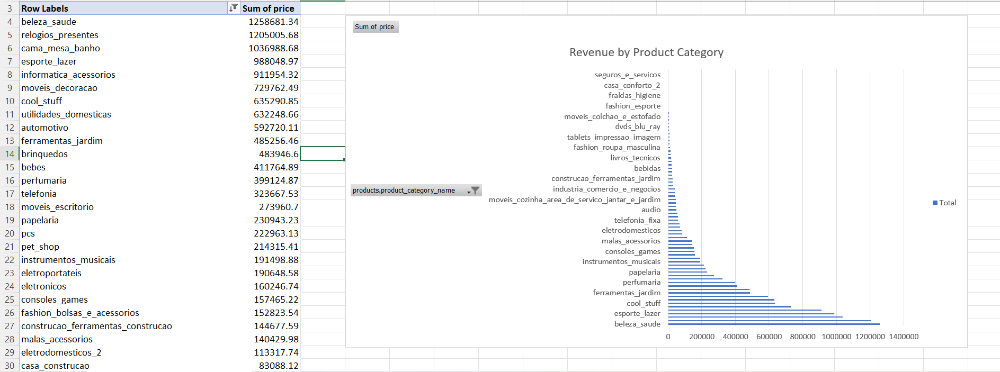
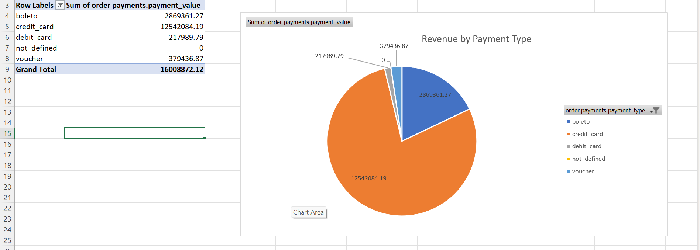
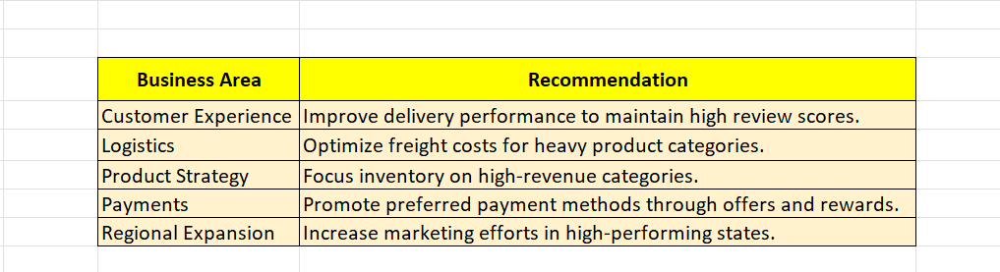

# 🛒 Quick Commerce Business Analytics Project


---

## 📌 Project Overview

This project is an end-to-end Business Analytics case study built using the Olist Brazilian E-Commerce dataset. It demonstrates the complete analytics lifecycle—from data exploration in Microsoft Excel to database management in MySQL, exploratory data analysis in Python, and interactive dashboard development in Power BI.

The project focuses on identifying customer purchasing patterns, product performance, payment behavior, geographical sales distribution, and business opportunities through data-driven analysis and visualization.

---

## 🎯 Business Objective

The objective of this project is to transform raw e-commerce data into meaningful business insights that support strategic decision-making.

Key objectives include:

- Analyze sales performance across different regions.
- Identify top-performing product categories.
- Understand customer purchasing behavior.
- Evaluate payment preferences.
- Measure customer satisfaction through review analysis.
- Generate actionable business recommendations.

# 🌟 Project Highlights

✅ End-to-End Business Analytics Project

✅ Microsoft Excel KPI Dashboard & Pivot Analysis

✅ SQL Data Cleaning & Business Queries

✅ Python Exploratory Data Analysis

✅ Interactive Power BI Dashboard

✅ Business Insights & Strategic Recommendations

---
# 📥 Dataset

This project is based on the **Olist Brazilian E-Commerce Dataset**, a publicly available dataset containing real-world Brazilian e-commerce transactions.

### Dataset Includes

- Customers
- Orders
- Order Items
- Products
- Sellers
- Payments
- Customer Reviews
- Geolocation
- Product Categories

**Dataset Source:** [Olist Brazilian E-Commerce Dataset (Kaggle)](https://www.kaggle.com/datasets/olistbr/brazilian-ecommerce)

> **Note:** The raw dataset is not included in this repository due to its large size. The complete dataset can be downloaded from the official Kaggle source using the link above. All analyses, dashboards, and insights presented in this project were developed using this publicly available dataset.

---

# 🛠️ Tools & Technologies

| Tool | Purpose |
|------|---------|
| Microsoft Excel | Initial Data Analysis, KPI Dashboard & Pivot Analysis |
| MySQL | Data Cleaning, Joins & Business Queries |
| Python | Data Validation & Exploratory Data Analysis |
| Power BI | Interactive Dashboard & Data Visualization |
| Git & GitHub | Version Control & Project Documentation |

---

# 🔄 Project Workflow

```text
Raw Olist Dataset
        │
        ▼
Microsoft Excel
(KPI Dashboard • Pivot Analysis • Business Insights)
        │
        ▼
MySQL
(Data Cleaning • Joins • KPI Queries • Business Analysis)
        │
        ▼
Python
(Data Validation • EDA • Data Export)
        │
        ▼
Power BI
(Interactive Dashboard & Visualization)
        │
        ▼
Business Insights & Recommendations
```

---
# 📊 Microsoft Excel Analysis

Microsoft Excel was used as the first stage of the project for exploratory business analysis.

### Activities Performed

- Data Exploration
- KPI Dashboard Creation
- Pivot Table Analysis
- Revenue Analysis
- Product Category Analysis
- Customer Analysis
- Payment Method Analysis
- Geographical Analysis
- Business Insights
- Business Recommendations

### Deliverables

- KPI Dashboard
- 8 Pivot Analysis Sheets
- Business Insights
- Business Recommendations

---

# 🗄️ MySQL Analysis

The SQL phase focused on transforming the raw data into a structured master dataset suitable for analysis.

### Activities Performed

- Database Creation
- Data Import
- Data Cleaning
- Missing Value Analysis
- Duplicate Checking
- Table Relationships
- Data Joins
- Master Table Creation
- KPI Queries
- Advanced Business Queries
- Business Insights

### SQL KPIs

- Total Revenue
- Total Orders
- Total Customers
- Average Order Value
- Average Review Score

---

# 🐍 Python Analysis

Python was used to validate and further analyze the SQL master dataset.

### Libraries Used

- Pandas
- NumPy
- Matplotlib

### Activities Performed

- Importing SQL Dataset
- Data Validation
- Exploratory Data Analysis (EDA)
- Data Cleaning Verification
- Data Visualization
- Exporting Final Dataset for Power BI

---

# 📈 Power BI Dashboard

An interactive dashboard was developed in Power BI to visualize business performance.

### Dashboard Pages

### 1️⃣ Executive Dashboard

Includes:

- Total Revenue
- Total Orders
- Total Customers
- Average Order Value
- Average Review Score
- Revenue by Product Category
- Revenue by State
- Revenue by City

### 2️⃣ Business Insights Dashboard

Includes:

- Payment Method Analysis
- Review Score Analysis
- Seller Performance
- Customer Distribution
- Product Performance
- Key Business Insights

---
# 📌 Key Performance Indicators (KPIs)

The following KPIs were calculated using SQL and validated through Python before being visualized in Power BI.
| KPI | Value |
|------|-------:|
| Total Revenue | **20,579,664.01** |
| Total Orders | **99,441** |
| Total Customers | **99,441** |
| Average Order Value | **206.95** |
| Average Review Score | **4.02 / 5** |

---

# 💡 Key Business Insights

Based on the analysis performed across Excel, SQL, Python, and Power BI, the following business insights were identified:

### 🌍 Geographic Insights

- São Paulo generated the highest overall revenue among all states.
- São Paulo city contributed the largest share of total sales.
- Revenue was highly concentrated in major metropolitan areas.

### 🛍️ Product Insights

- **Bed, Bath & Table** was the highest-selling product category.
- **Beauty & Health** and **Computers & Accessories** were among the top revenue-generating categories.
- A small number of product categories contributed a significant portion of total revenue.

### 💳 Payment Insights

- Credit Card was the most preferred payment method.
- Boleto was the second most frequently used payment option.
- Debit Card and Voucher transactions represented a relatively small share of total payments.

### ⭐ Customer Insights

- Most customers gave products a review score of **5**.
- Customer satisfaction was generally high across the platform.
- Low review scores accounted for only a small percentage of total orders.

### 🏪 Seller Insights

- A limited number of sellers generated a large proportion of total revenue.
- Seller performance varied significantly across the marketplace.

---

# 🚀 Business Recommendations

Based on the findings, the following recommendations are proposed:

- Increase inventory for high-performing product categories.
- Focus marketing campaigns on high-revenue states and cities.
- Improve visibility of underperforming product categories.
- Strengthen seller performance monitoring programs.
- Continue promoting secure digital payment methods.
- Improve customer experience to maintain high review ratings.
- Expand operations into regions with lower market penetration.
- Use customer purchasing patterns for targeted marketing campaigns.

---

# 📂 Project Structure

```text
Quick-Commerce-Analytics
│
├── Excel
│   ├── KPI_Dashboard.png
│   ├── Geographic_Analysis.png
│   ├── Product_Analysis.png
│   ├── Customer_Payment_Analysis.png
│   ├── Business_Insights.png
│   └── Business_Recommendations.png
│
├── Images
│   ├── Dashboard.png
│   └── Business_Insights.png
│
├── Power BI
│   └── Quick Commerce BI File.pbix
│
├── Python
│   └── Quick_Commerce_Python_Analysis.ipynb
│
├── SQL
│   └── Quick_Commerce_SQL_Project.sql
│
└── README.md
```

---
# 📦 Repository Contents

| Folder | Description |
|---------|-------------|
| Excel | KPI Dashboard, Pivot Analysis, Business Insights & Recommendations |
| SQL | Complete SQL Project Script |
| Python | Jupyter Notebook for EDA & Data Validation |
| Power BI | Interactive Dashboard (.pbix) |
| Images | Dashboard Screenshots |
| README.md | Project Documentation |

## Executive Dashboard



---

## Business Insights Dashboard




# 📊 Excel Analysis Preview

## KPI Dashboard



---

## Geographic Analysis



---

## Product Analysis



---

## Customer & Payment Analysis



---

## Business Recommendations



---

# 📈 Project Results

This end-to-end business analytics project successfully transformed raw e-commerce data into actionable business intelligence using Microsoft Excel, MySQL, Python, and Power BI.

### Key Outcomes

- Successfully integrated multiple raw datasets into a unified master dataset.
- Developed KPI dashboards to monitor overall business performance.
- Identified top-performing states, cities, and product categories based on revenue.
- Analyzed customer purchasing behavior and payment preferences.
- Evaluated customer satisfaction using review score analysis.
- Designed an interactive Power BI dashboard for executive decision-making.
- Generated data-driven business insights and strategic recommendations to improve sales performance and customer experience.

# 🎯 Skills Demonstrated

- Business Analytics
- Data Cleaning
- Data Modeling
- SQL Query Writing
- KPI Development
- Exploratory Data Analysis (EDA)
- Data Visualization
- Dashboard Design
- Business Intelligence
- Problem Solving
---
# 🎓 Learning Outcomes

Through this project, I gained practical experience in:

- Business Analytics
- Data Cleaning
- SQL Query Writing
- Exploratory Data Analysis (EDA)
- KPI Development
- Dashboard Design
- Data Visualization
- Business Intelligence
- Git & GitHub
- End-to-End Analytics Workflow

# 🚀 Future Enhancements

Potential future improvements include:

- Sales forecasting using Machine Learning
- Customer segmentation (RFM Analysis)
- Interactive Excel Dashboard
- Time-Series Analysis
- Customer Lifetime Value (CLV) Analysis
- Predictive Analytics using Python

# 👨‍💻 Author

## Ayush Raj

**MBA | Aspiring Business Analyst | Data Analyst**

### Technical Skills

- Microsoft Excel
- MySQL
- Python
- Power BI
- SQL
- Business Analytics
- Data Visualization
- Dashboard Development
- Git & GitHub

---

### Connect with Me

⭐ If you found this project useful, consider giving it a Star.

Thank you for visiting this repository!

---
